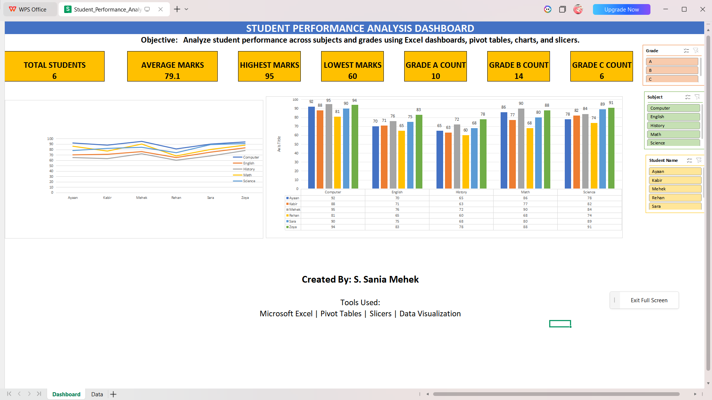

# Student Performance Analysis Dashboard

[](https://www.linkedin.com/in/saniamehekshaik1004)

[](https://github.com/shaiksaniamehek1004-cell)

## Project Overview

This project focuses on analyzing student academic performance using Microsoft Excel. The dashboard provides an interactive way to explore student marks, subject-wise performance, and overall academic trends through visualizations and KPI metrics.

## Objective

The objective of this project is to transform raw student performance data into meaningful insights using Excel Dashboards, Pivot Tables, Charts, and Slicers.

## Dataset Information

The dataset contains the following attributes:

* Student Name
* Student ID
* Class
* Gender
* Subject
* Marks Obtained
* Maximum Marks
* Grade

## Tools Used

* Microsoft Excel
* Pivot Tables
* Pivot Charts
* Slicers
* Data Visualization

## Features

* Interactive Excel Dashboard for student performance analysis.
* KPI Cards displaying key metrics.
* Student-wise Performance Analysis.
* Subject-wise Performance Analysis.
* Interactive Slicers for dynamic filtering.
* User-friendly dashboard layout.
* Real-time dashboard updates based on slicer selections.
* Clean dashboard design with hidden Pivot Table sheets.

## Dashboard Features

### KPI Metrics

The dashboard includes the following KPIs:

* Total Students: 6
* Average Marks: 79.1
* Highest Marks: 95
* Lowest Marks: 60
* Grade A Count: 10
* Grade B Count: 14

### Interactive Analysis

Users can dynamically filter the dashboard using slicers based on:

* Student Name
* Subject
* Grade

### Visualizations

* Student-wise Performance Analysis Chart
* Subject-wise Performance Analysis Chart

## Key Insights

* Highest score achieved: 95
* Average student score: 79.1
* Grade B is the most common grade in the dataset.
* Dashboard enables quick identification of student and subject performance trends.
* Interactive filters improve data exploration and analysis.

## Dashboard Preview



## Project Structure

```text
Student-Performance-Analysis-Excel
│
├── Student_Performance_Analysis_Dashboard.xlsx
├── Dashboard.png
└── README.md
```

## Learning Outcomes

Through this project, I gained hands-on experience in:

* Creating interactive dashboards in Excel
* Working with Pivot Tables and Pivot Charts
* Designing KPI cards
* Using Slicers for dynamic filtering
* Transforming raw data into actionable insights
* Data visualization and reporting

## Author

**S. Sania Mehek**

Aspiring Data Analyst | AI & Data Science Student

### Connect with Me

* LinkedIn: www.linkedin.com/in/saniamehekshaik1004

* GitHub: https://github.com/shaiksaniamehek1004-cell
